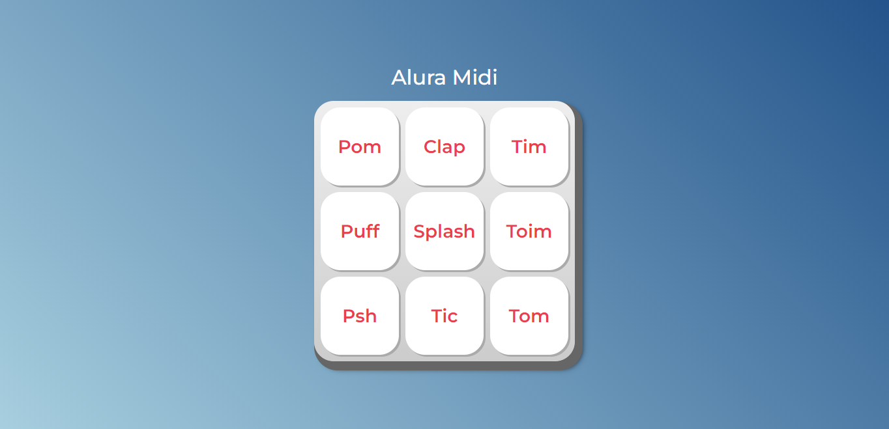

# Alura-Midi

Course provided by **Alura** with **Vanessa Me Tonini** as an instructor: 
<a href="https://cursos.alura.com.br/course/javascript-web-paginas-dinamicas" target="_blank"> Click here to access </a>

# Site Preview 

# Course Concept 

This time, the Alura student will create "Alura Midi", This project is a musical keyboard. All keys have 
different sounds, and when the user clicks in one of them, the sound has to leave.

# Major Knowledges 

- Introduction to Js in webpages
- Introduction to DOM manipulation
 
